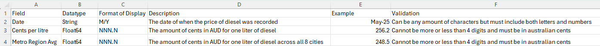

# 9CT-Task-1

Due to wars in the middle east, where cargo carrying our diesel and petroleum pass through, Australia is currently facing a national crisis with fuel prices rising much higher than ever before. This is caused due to the Strait of Hormuz being closed due to disruptians from the war in Iran along with the oil/diesel  factories being destroyed by crossfire forcing them to halt roughly 20% of global oil shipments.For example, in the past year, specifically New South Wales, diesel prices have risen by around a dollar. As of may 2025 the price was approximately 181 cents per litre, with it now being 285 cents per litre on average. So due to disruptions by the war we're unable to get diesel consistently or in large amounts leading to the rise in demand and the fall in supply causing prices to rise significantly

